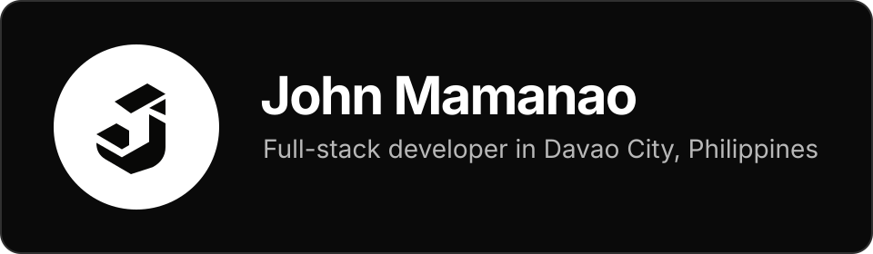

  

  
  
  

 

  I build product interfaces, browser tools, APIs, and automation systems. 
  I care about clear interactions and software that stays understandable after launch.

  <code>TypeScript</code>&nbsp;&nbsp;
  <code>React</code>&nbsp;&nbsp;
  <code>Next.js</code>&nbsp;&nbsp;
  <code>Angular</code>&nbsp;&nbsp;
  <code>Laravel</code>&nbsp;&nbsp;
  <code>Node.js</code>

